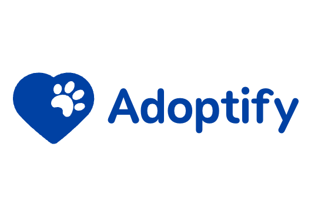

    

Adoptify
---

Adoptify is a collectible Theta NFT platform for streamers to boost adoption rates of pets in shelters

Built for the Theta devpost 2023 hackathon.

<!-- Live Demo: 

Video: -->

### Motivation
Our motivation for building Adoptify was to create a platform that can make a real difference in the lives of shelter animals. We wanted to use the power of NFTs and blockchain technology to raise awareness and drive adoption rates of pets in shelters. Our goal was to create a community of like-minded individuals who are passionate about animal welfare and can work together to make a positive impact.

## How to run

Adoptify requires a metamask wallet for authenticating NFT and purchase transactions.

Follow the guide here to set up metamask:
https://docs.thetatoken.org/docs/web3-stack-metamask

Once metamask is installed, run the project locally.

`yarn; yarn start`

The app should now be running on port 3000.

### How we built it
We built Adoptify using the Theta blockchain and smart contracts. We used React for the frontend and Solidity for the smart contract development. We also integrated IPFS for storing the NFT metadata and images. We created a web3 adoption experience where users can interact with their NFTs and receive regular updates on their animals. We also connected with influencers and artists to help spread the word and drive more support for the cause.

### Challenges we ran into
One of the biggest challenges we faced was designing a user-friendly interface that could handle complex smart contract interactions. We also had to figure out how to store the NFT metadata in a decentralized manner and make it easily accessible for users. Another challenge was to ensure the security of the platform and prevent any potential attacks or exploits.

### Accomplishments that we're proud of
We are proud of creating a platform that can make a real difference in the lives of shelter animals. We were able to bring together a community of like-minded individuals who are passionate about animal welfare and can work together to drive adoption rates. We were also able to create an immersive web3 adoption experience that allows users to connect with their animals and receive regular updates.

### What we learned
Throughout the development process, we learned a lot about the power of blockchain technology and how it can be used to create innovative solutions. We also learned about the challenges of building a decentralized platform and how to address them. We gained valuable experience in smart contract development, frontend development, and web3 integration.

## Potential future work
* Develop a mobile application for Adoptify to make it more accessible to a wider audience.
* Implement a rewards system for users who adopt pets through the platform to incentivize adoption rates.
* Create partnerships with pet supply companies and veterinarians to provide discounts and special offers for users who adopt pets through Adoptify.
* Integrate a donation system where users can donate directly to their favorite shelters or animal welfare organizations.
* Explore the use of Theta to track and verify the health and history of pets, making it easier for adopters to understand their new pet's needs and background.